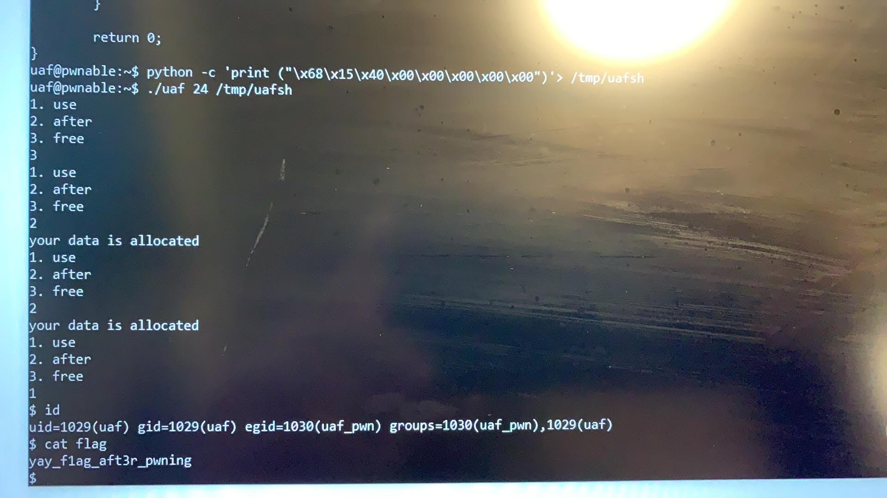

Readme

Please find the solution with comment.
This is a typical UAF problem. Normally, we allocate memory for content or data, and we can access it. Afterwards, we can remove it. the issue of UAF
is we access a deallocated memory after it is deleted, and overwriting the vtable pointer address with the address to the private method with /bin/sh.

Binary:[Download](uaf)
Source Code:[Source Code](uaf.cpp)
